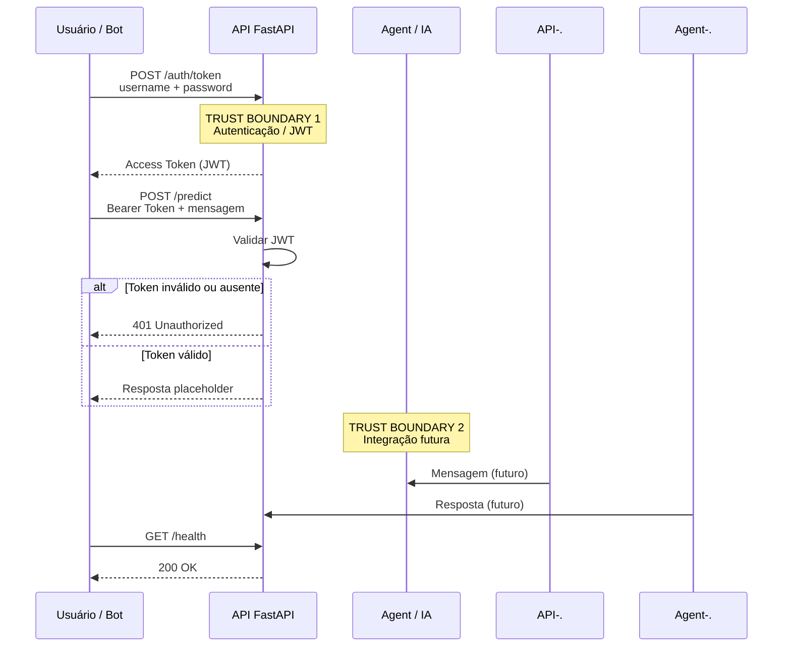

# DFD — E-ComShield

## Diagrama

## Análise CIA

| Componente | Confidencialidade | Integridade | Disponibilidade |
|---|---|---|---|
| Usuário / Bot | Credenciais, tokens e mensagens devem ser protegidos | Mensagens não devem ser alteradas durante o transporte | Deve conseguir enviar requisições |
| FastAPI | Tokens e dados recebidos devem ser protegidos | Autenticação e requisições devem ser validadas | API deve permanecer disponível |
| Agent *(integração futura)* | Mensagens e contexto podem conter dados sensíveis | Respostas não devem ser manipuladas | Deve estar disponível para processar solicitações |
| Dataset | Dados devem ser protegidos conforme sua sensibilidade | Dataset não deve ser alterado indevidamente | Deve estar disponível para EDA e treinamento |
